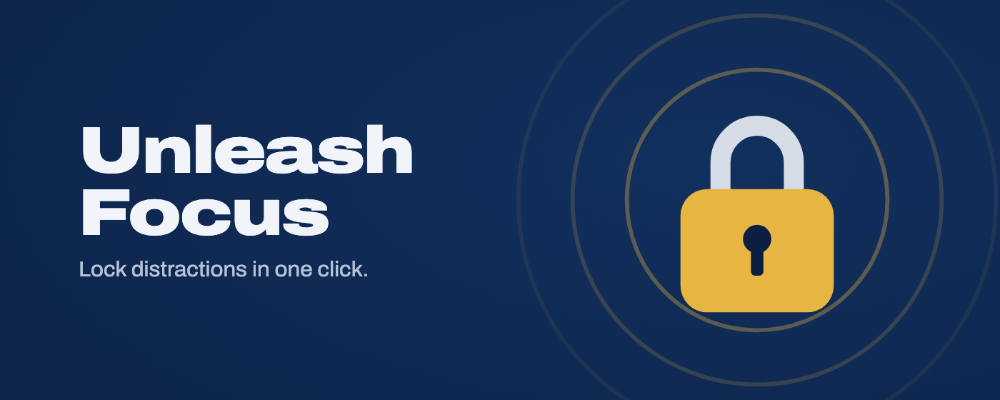
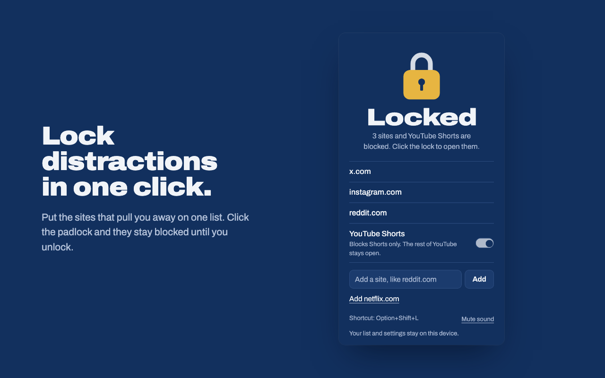
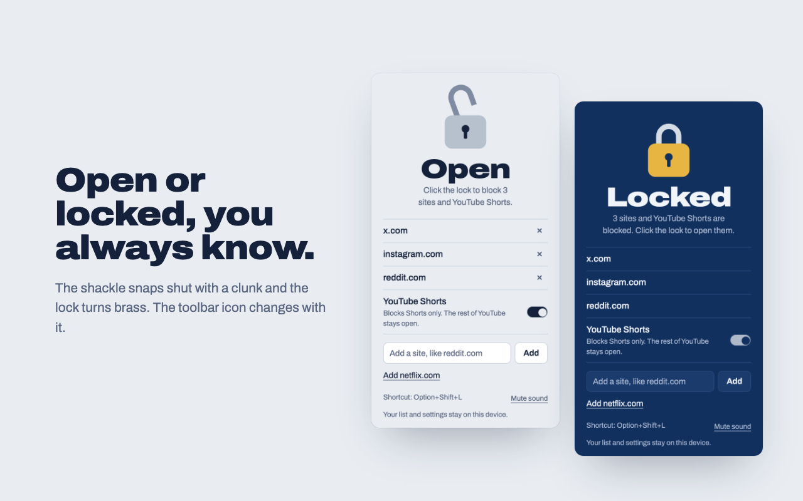
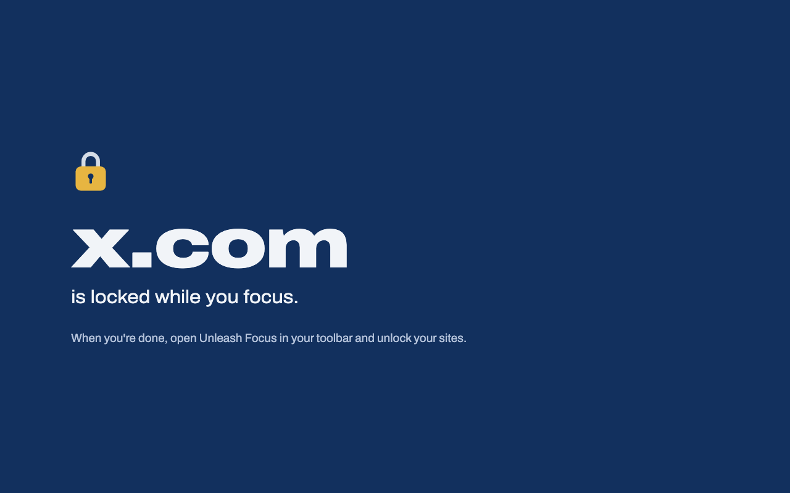
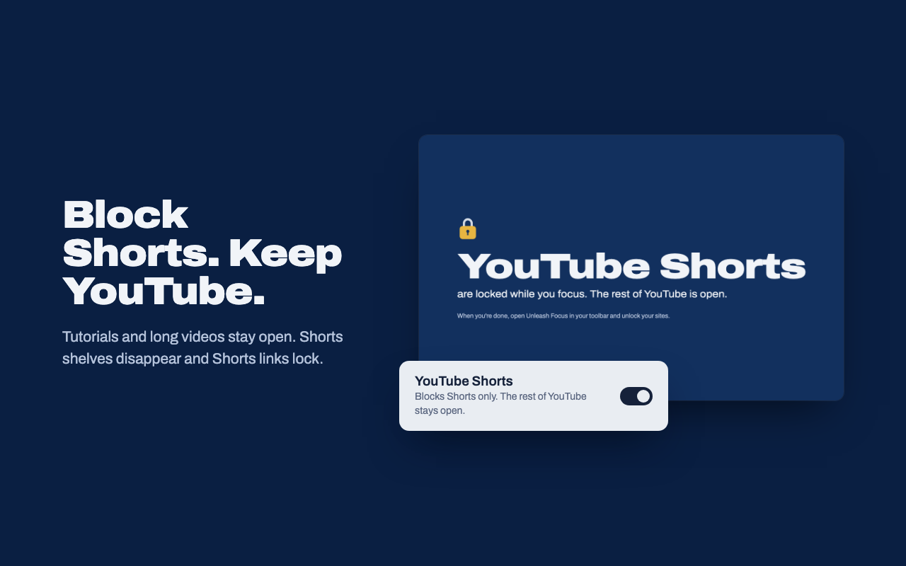
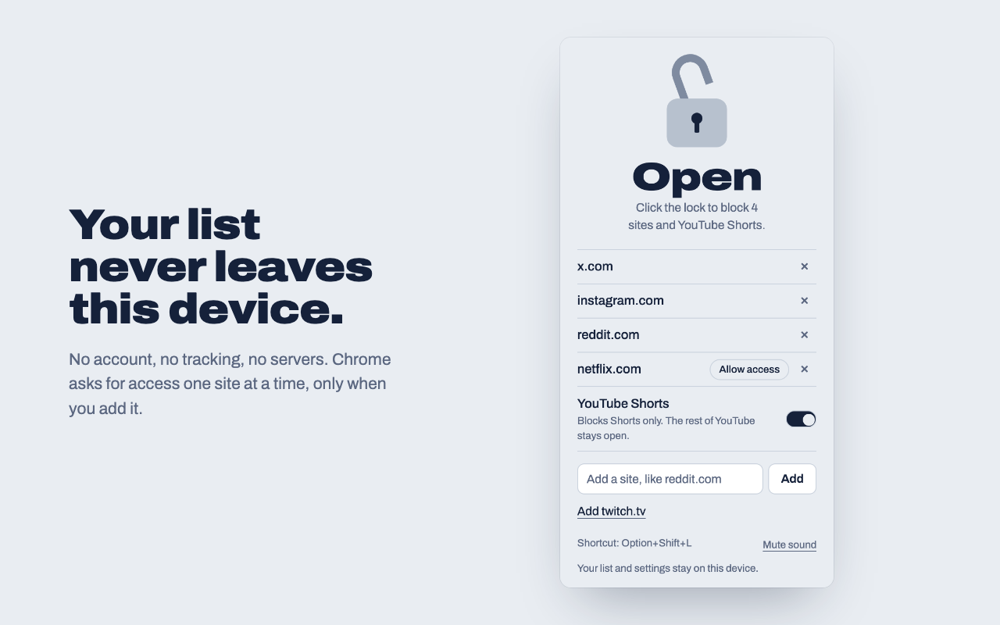

# Unleash Focus

Lock distracting sites, YouTube Shorts and Instagram Reels with one click. Unlock when you're done. Nothing leaves your device.

## What it does

Put the sites that pull you away on a list. Click the padlock and they're blocked until you click it again. No schedules and no timers: lock when you start focusing, unlock when you're done.

- One click locks and unlocks your whole list.
- Blocks whole sites, including addresses like m.facebook.com or old.reddit.com.
- Tabs already open on a blocked site switch to the locked page when you lock, and go back to where they were when you unlock.
- YouTube Shorts switch: blocks Shorts and hides Shorts shelves, while the rest of YouTube stays open.
- Instagram Reels switch: blocks Reels and hides videos in your feed, while photos, stories and messages stay open.
- No sneaking out mid-focus: you can't remove sites or turn off the Shorts and Reels switches while locked.
- Keyboard shortcut: Alt+Shift+L (Option+Shift+L on Mac).
- The padlock snaps shut with a clunk. You can mute it.

  
  

  
  

  

## Install

Install it from the Chrome Web Store once it's published, or load it yourself:

1. Download or clone this repository.
2. Open `chrome://extensions` and turn on **Developer mode**.
3. Click **Load unpacked** and choose this folder.
4. Pin Unleash Focus from the puzzle-piece menu in the toolbar.

To block sites in incognito windows too, open the extension's details in `chrome://extensions` and turn on **Allow in Incognito**.

## How to use

1. Click the padlock in the toolbar. x.com is on the list to start with, and the YouTube Shorts and Instagram Reels switches are on.
2. Add a site by typing its address, or click "Add <site>" to add the one you're on.
3. Chrome asks for access to each site the first time. A site without access shows **Allow access** and isn't blocked until you allow it.
4. Click the padlock to lock. Click it again to unlock. The toolbar icon shows which state you're in: brass and closed when locked, grey and open when not.

While locked, a small padlock next to each site and switch shows what's blocked: closed if it is, open if it isn't. You can add sites but not remove them. Unlock first. You can change the keyboard shortcut at `chrome://extensions/shortcuts`.

## YouTube Shorts

The **YouTube Shorts** switch is on by default. While locked, Shorts links go to the locked page and Shorts shelves disappear from the home page, search results, channels and the sidebar. Everything else on YouTube works as usual.

YouTube changes its page layout from time to time. If Shorts shelves come back, the selectors in `shorts.css` need updating.

## Instagram Reels

The **Instagram Reels** switch is on to start with. The first time you lock, Chrome asks for access to instagram.com. While locked, the Reels page and any reel you open go to the locked page, and Reels disappear from your home feed, Explore, the sidebar and profiles. Photos, stories and messages still work.

You don't need instagram.com on your list for this. If it is on your list, all of Instagram is blocked anyway.

Instagram changes its page layout from time to time. If Reels come back in the feed, the selectors in `reels.css` and `reels.js` need updating.

## Privacy

No account, no tracking, no ads, no servers. Your list and settings are stored only on your device. Chrome asks for access one site at a time, only for sites you add, and for instagram.com if you turn on the Reels switch. Read the full [privacy policy](PRIVACY.md).

## For developers

Plain JavaScript, Manifest V3, no build step. After changing the code, click the reload arrow on the extension's card in `chrome://extensions`.

How blocking works:

- A `declarativeNetRequest` rule redirects requests to listed sites, and to `youtube.com/shorts` and Instagram Reels pages, to `blocked.html` while locked. The original address travels along in the URL so the page can go back to it on unlock.
- Some sites (x.com, for example) open pages from cache without a network request, and YouTube and Instagram open Shorts and Reels without a page load. `background.js` also watches tab addresses and redirects any tab that lands on a blocked page.
- `hide.js` marks YouTube and Instagram pages while locked, so `shorts.css` and `reels.css` can hide Shorts and Reels. On Instagram, `reels.js` also remembers which posts are videos, because Instagram removes a post's video while it's off screen. On Instagram it's registered from `background.js`, only once access to instagram.com is allowed.
- Locking redirects tabs that are already open on listed sites, after a short pause so the popup's padlock animation can finish. Unlocking sends them back.
- Permissions are kept small: `declarativeNetRequestWithHostAccess`, `storage`, `activeTab`, `scripting`, fixed access to youtube.com, and optional access to other sites requested one at a time. The Reels switch uses the same optional access to instagram.com.

Sounds are made with Web Audio in `sounds.js`, so there are no audio files. The Archivo font is bundled under the SIL Open Font License (`fonts/OFL.txt`).

## Releasing

- Bump `version` in `manifest.json` for every store update.
- `scripts/package.sh` builds `dist/unleash-focus-<version>.zip` from the last commit, leaving out docs, scripts and store assets.
- Publish a [GitHub release](https://github.com/AyushUnleashed/unleash-focus/releases) with the zip attached and a short list of what changed.
- `store/` holds the Chrome Web Store listing text, screenshots and promo images.
